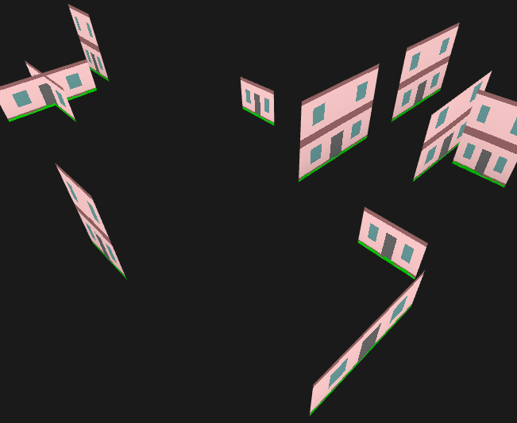

# The City Without That Number

# Resources

## Programming Articles

* WebGL2:
    * [WebGL2 Smallest Programs](https://webgl2fundamentals.org/webgl/lessons/webgl-smallest-programs.html)
    * [WebGL Anti-Patterns](https://webgl2fundamentals.org/webgl/lessons/webgl-anti-patterns.html)
    * [WebGL2 - Less Code, More Fun](https://webgl2fundamentals.org/webgl/lessons/webgl-less-code-more-fun.html)
    * [WebGL2 Points, Lines, and Triangles](https://webgl2fundamentals.org/webgl/lessons/webgl-points-lines-triangles.html)
    * [WebGL2 Indexed Vertices](https://webgl2fundamentals.org/webgl/lessons/webgl-indexed-vertices.html)
    * [WebGL2 3D Perspective](https://webgl2fundamentals.org/webgl/lessons/webgl-3d-perspective.html)
    * [WebGL2 Drawing Without Data](https://webgl2fundamentals.org/webgl/lessons/webgl-drawing-without-data.html)
        * [Solid gl.POINTS emulation](https://jsgist.org/?src=6306857bfd65adbdcd54b0051d441935)
* Shader Programming:
    * [The Book Of Shaders - Chapter 10: Random](https://thebookofshaders.com/10/)
    * [The Book Of Shaders - Chapter 11: Noise](https://thebookofshaders.com/11/)
* Audio/Music:
    * [Alphabet-Piano](https://xem.github.io/alphabet-piano/)
    * [Zzfx](https://github.com/KilledByAPixel/ZzFX) - Used for sound effects
    * [ZzfxM](https://github.com/keithclark/ZzFXM) - Used for music
* Misc:
    * [GitHub - Scripts to Rule Them All](https://github.com/github/scripts-to-rule-them-all/tree/2e68071ef33c5c6f0d525db00997cd333ff93e8d)
    * [StackOverflow - Smoothed FPS Counter](https://stackoverflow.com/a/7796547/9157179)

## Music Inspiration

As I'm building a city builder, I have to go back to the city builder I grew up on: SimCity 4 Deluxe Edition. I don't want to replicate the soundtrack exactly, and I've heard it so many times I practically have it all memorized, but I found the slightly slower bpm of the live cover of "By The Bay" [here](https://www.youtube.com/watch?v=qR4IIKbRflQ) to be a good split from my memory to help me think about it. I also found Charles Cornell's analysis video on the [Sims 1 Building Mode 1 track](https://www.youtube.com/watch?v=IJMds3jT7c8) to be extremely valuable, as those building mode tracks were also a big part of my childhood and fit well into the smaller-scale city builder I'm building.

# Changelog by day

## Day 1: 2024-08-13

Started with an empty folder, wrote up `serve_hot.py` Python hot-reloading server, built on `aiohttp` and `watchfiles`. I then found and began following along with the [WebGL2 Smallest Programs](https://webgl2fundamentals.org/webgl/lessons/webgl-smallest-programs.html) blog post. I have 5 data-texture points moving up and down to a sine wave across the viewport. Most of my time went to the hot reloader and to fixing my viewport issues with the tips in [WebGL Anti-Patterns](https://webgl2fundamentals.org/webgl/lessons/webgl-anti-patterns.html). Not everything I agreed with, but the tips worked like nothing else I've tried. Starting now on [WebGL2 - Less Code, More Fun](https://webgl2fundamentals.org/webgl/lessons/webgl-less-code-more-fun.html) to see if I can prepare some helper functions to make my life easier.

Issues: The hot reloader won't quit without `kill -9`. Need to figure out what's eating the KeyboardInterrupts.

## Day 2: 2024-08-14

Started writing this changelog and initialized source control to make sure I don't lose track of my progress. Also dug deep into the `aiohttp.web.run_app` implementation to determine why it was eating my `KeyboardInterrupt`s. Turns out it had nothing to do with that -- my `await change.wait()` (which waits on an `asyncio.Event`) was never getting the `CancelledError` that the rest of the system was. Eventually I gave up and made a `shutdown_event`, then copied the `aiohttp.web.run_app` functionality to stick in a `shutdown_event.set()` call before final shutdown. This forces me to poll both the `shutdown_event` and my new file change lamport clock, but it does now work. I suspect the issue is that I'm supposed to return my Websocket and hold onto it for my own purposes, but I always assumed that closed the port. Will experiment tomorrow.

Did I get any work done on my game today? _No. But I did get a lot of work done on my development environment, and that's important too._ (Emphasis written by GitHub Copilot.)

## Day 3: 2024-08-15

Today, added the Scripts-To-Rule-Them-All pattern from [https://github.com/github/scripts-to-rule-them-all/](https://github.com/github/scripts-to-rule-them-all/tree/2e68071ef33c5c6f0d525db00997cd333ff93e8d), cleaned up `serve_hot.py`'s requirements and interface (added an `argparse.ArgumentParser`) then implemented a smoothed FPS counter from [this StackOverflow post](https://stackoverflow.com/a/7796547/9157179). To that, I added a cap on the frame number, to cause it to reach a certain number of frames of "history" then continue updating as if it was only at that point. This makes it responsive to current events but not too responsive to outliers. I also capped the number of updates of the display of the FPS counter to 4 times per second to make it legible and prevent it flickering distractingly.

## Day 4: 2024-08-16

No progress. (Roommates invited me out to a party.😎)

## Day 5: 2024-08-17

Researched the WebAudio API and explored options for building my own music system. I came across this neat little [Alphabet-Piano](https://xem.github.io/alphabet-piano/) that I tried referencing for a system of my own, but I realized I would struggle to create audio with something like that in the ways I wanted, and that it was relatively expensive bytes-wise compared to what I eventually chose. I settled on using [Zzfx](https://github.com/KilledByAPixel/ZzFX) for audio, with the add-on [ZzfxM](https://github.com/keithclark/ZzFXM) for music, as the authors' understanding of audio engineering better compressed any sounds than I could have managed and their API is extremely flexible. They also have authoring tools for making the sounds and music in their format, which will save me a bunch of fumbling about in my text editor as I was doing with the Alphabet-Piano.

Also expanded the Makefile to fetch the Zzfx and ZzfxM scripts from GitHub, and changed Scripts-To-Rule-Them-All to use the Makefile for boostrapping, that way if the scripts are already present we won't re-download them.

## Day 6: 2024-08-18

We have house! First perspective rendering results today, albeit with zero game engine behind them.

## Day 7: 2024-08-19

Instanced rendering is difficult when you use `gl.drawArraysInstanced` for a rendering that should be indexed. (For those keeping track, the correct call is `gl.drawElementsInstanced`.)

I got it working, though! And then things started to look great! (To clarify: building "development stages" are currently faked with divisions of the instance ID, not passed in from a real data array.)

## Day 8: 2024-08-20

No progress. LeetCode Daily was a very difficult Hard, and I also chose to stream some of my Angels with Scaly Wings in-progress modding to fellow members of the Angels With Scaly Wings Unofficial Fan Discord.

## Day 9: 2024-08-21

Today I implemented a "system" loop (think UI + frame management) and screened the file out into comment-demarcated sections by functionality. With this system loop, I also implemented input management, allowing us to move the camera around the map! Not a crazy-visible change like the graphics over the past few days, so I decided to take it upon myself to do some matrix math by hand to give the camera a 45 degree swing to the right, giving us a nice isometric-like view that's still full 3D perspective.

## Day 10: 2024-08-22

No progress. Grocery shopping, exhaustion, and YouTube stole my time.

## Day 11: 2024-08-23

No progress. Simply too tired. I need to get more sleep.

## Day 12: 2024-08-24

No progress. Got more sleep and wound up with a headache _all day_ as a result of not getting enough sleep for so long. Started a custom-system TTRPG with some online friends, though, which was nice.

## Day 13: 2024-08-25

Got a bunch of things done now that I got more sleep (no thanks for going to bed nearly 3:30am.)

* Added building construction!
  * No longer is it faked in the vertex shader!
* Added random construction
  * Every frame, has an "equal" chance to pick any tile and build a random building type on it.
    * Technically tiles that come first have higher chance, since only one tile may be picked, otherwise the game rules get nasty to implement.
  * Used this construction process to create a project logo:

    
* Added a subtle lighting system
  * Tall buildings block some light on the ground around their base

    
* Added height limits
  * Why? THE VOID.

    
* Added building types
  * So far just commercial, residential, and ERROR. We'll see how far we get with those.

    
    * ERROR (not shown) has already helped me understand and fix three bugs!

Had to spend nearly half an hour sorting out why side-length 7 and 13 maps would have the wrong shape. Appears to be some kind of driver-level compiler bug around floating-point modulo division. Fixed by adding an epsilon to the float-converted instance ID before taking the modulo.

I had meant to do user interaction, but giving some feedback for that interaction came first. Also gave a brief try to making music and found I've forgotten a lot of what I once knew. Ah well! I'm sure I'll make something not too grating.

## Day 14: 2024-08-26

No progress. Made the mistake of chatting with online acquaintances on Discord.

## Day 15: 2024-08-27

No progress. Prioritized getting to bed before 1am by doing my unrelated fanfic writing at a reasonable hour.

## Day 16: 2024-08-28

Tried my hand at making something of a song in the ZzFXM tracker. Not a truly terrible track, but not enough to put into the game. I did discover a few sounds suitable for sound effects, though, so those have been checked into the repository.

## Day 17: 2024-08-29

No progress. Big work presentation led to me kinda shutting down once I was home.

## Day 18: 2024-08-30

No progress. LeetCode Daily was annoyingly difficult and the daily for the next day was bugged. I didn't feel like doing more coding after dealing with that.

## Day 19: 2024-08-31

No progress. Hike with friends.

## Day 20: 2024-09-01

Added hover, sound, and mute button. (Still no placement.)

Also went through this nightmare shader space so that I can (in the future) support double buildings slotted in more than a single direction.

Turning this into a real game, almost!